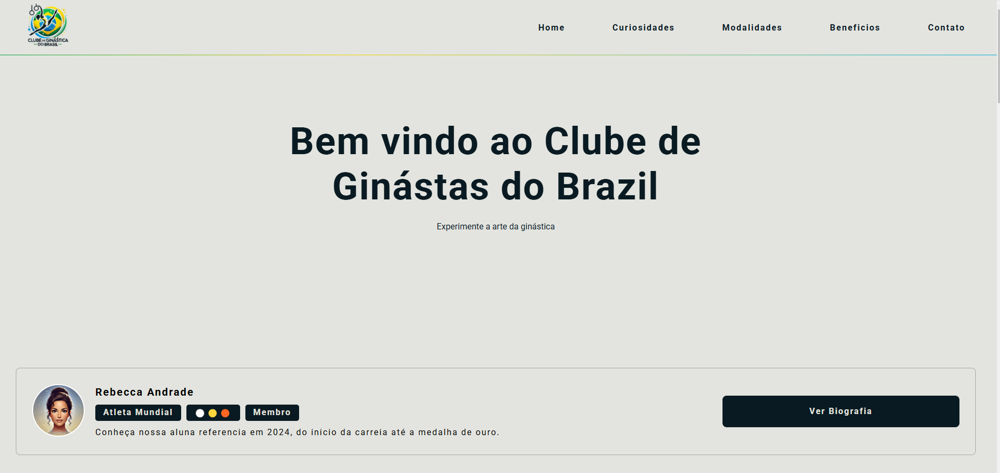
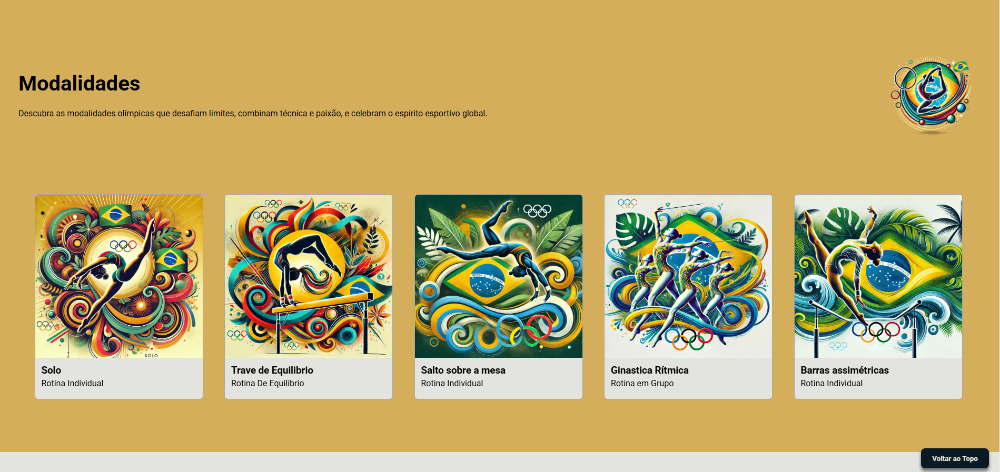

# LandingPage Clube de Ginastica 

## Sobre
Minha landing page foi desenvolvida com o objetivo de atrair alunos e promover a prática da ginástica artística no Brasil. O site está estruturado para oferecer informações claras e motivadoras sobre o esporte, destacando seus benefícios e modalidades. 

Com um design moderno e informativo, o sistema foi criado para inspirar, informar e engajar novos alunos a se apaixonarem pela ginástica artística e se unirem ao clube.


## Funcionalidades

- ``Home`` A home page apresenta um banner com as ginatas do ano e também um card com a atleta destaque. O usuario pode conhecer o atleta clicando sobre o botão **Ver Biografia**.
- ``Curiosidades`` A sessão curiosidade trás as 6 curiosidades mais importantes na ginastisca nacional.
- ``Modalidades`` Nesta sessão apresentamos algumas modalidades do esporte, afim de inspirar futuros atletas.
- ``Beneficios`` Os beneficios que a vida de gisnasta pode trazer aos atletas, apresentado em forma de nuvem.
- ``Entre em Contato`` O formulario de contato contém um campo de NOME e outro para E-MAIL. O envio de e-mail não foi implementado, implementada somente validações de campos e mensagens de sucesso e erros.
- ``Links Uteis`` Está sessão é reservada a links uteis, aqui o usuario é direcionado ao website oficial de gisnatica mundial e também pode conhecer o linkedin do desenvolvedor deste sistema.

## Tecnologias Utilizadas

- **Html:** Utilizado semantica Html.
- **Css:** Aplicado responsividade e uso de variaveis para gerencia tamanhos de fonts e cores do sistema.
- **JavaScript:** Controla o loading das paginas do sistema, envios de formulario e exibição condicional de mensagens.


## Instalação

Para rodar este projeto localmente, siga os passos abaixo:

1. Clone o repositório:
   ```bash
   git clone https://github.com/JosueCosta2023/janGinasticaClub.git

2. Execute servidor GoLive
    ```bash
    Go Live do VsCode 
### Ilustração
<div style="display:flex, justifyContent: center, width: 1024px">
    Home Page
    
</div>

<div style="display:flex, justifyContent: center, width: 1024px">
    Modalidades:
    
</div>
<div style="display:flex, justifyContent: center, width: 1024px">
    Menssagem de erro
    
</div>
<div style="display:flex, justifyContent: center, width: 1024px">
    Menssagem de Sucesso
    
</div>
<hr>
<p>Demonstração para Mobile</p>


## Author
### Josué Ocanha Costa
#### FrontEnd Developer
#### Redes Sociais

- Linkedin - [JosueOcanhaCosta](https://www.linkedin.com/in/josue-ocanha-costa/)
- Github - [JosueCosta2023](https://github.com/JosueCosta2023)
- Twitter - [@JosueOcanhaCosta](https://twitter.com/josue_ocanha)
- Facebook - [JosueCosta](https://www.facebook.com/JosueOcanhaCosta2023)
- Whatsapp - [Josue2023](https://wa.me/5565996408371?text=Ol%C3%A1%2C+encontrei+seu+whatsapp+no+Github.+Gostaria+de+falar+sobre+seus+projetos.)

# "Vida longa e próspera. 🖖🖖🖖"
Feito com o ❤️ por Josué Ocanha Costa
## [Acesse o Deploy](https://josuecosta2023.github.io/janGinasticaClub/)
### [Acesse o repositório](https://github.com/JosueCosta2023/janGinasticaClub)